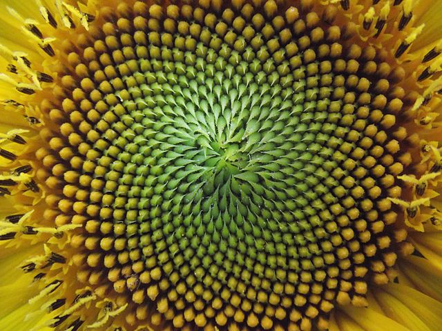

# Welcome!


 NOTE: This is a **living document** that will change and grow over time. 


 

This is _Alternative Computer Science_, aka **MS 059 SC.** As the name suggests, the idea behind this class is to provide an alternative approach to learning Computer Science. We will proceed by making analog things \(some of which compute in some way\), identifying the information contained or generated by these things, and them translating them into Python code.


**Models are for insights, not numbers**


Take this image of a sunflower. Do you see any familiar shapes inside? Could you draw this pattern? Could you isolate the generative pattern and write code to reproduce those patterns? You will by the time we start working on the **recursion module**. 

Let's work through a simple example. 

## This class in a nutshell: MODULE: You are a superhero!

Becoming a super hero is a fairly straight forward process. You can do it this way:


ANALOG LAB: Use a pen to write "I am a superhero!" on a sticky note. 


 


INSTRUCTION: How will you identify an algorithm to reproduce the work you did in the Analog Lab?


Let's talk about what I am asking you to do / how you interpret this instruction. Will you?

1. reproduce the movements I used to make those shapes?
2. map the colors from one medium to another?
3. measure the relationship between red and yellow?
4. identify letterforms and record their sequence?

Let's start at the end.


CODE LAB: Use Python to reproduce your work from our last Analog Lab.


```python
# FOUR: identify letterforms recorded on the sticky
# and reconstitute their sequence in Python

print("I am a superhero!")
```

`I am a superhero!`

**Ask Yourselves:**

1. are these things the same?
2. How did we get from one to another?
3. Did we preserve everything in going frmo one to another?
4. are you satisfied with this mapping?

**Activities, Assessment, Points**

| **Activity** | **Assessment** | **Points** |
| :--- | :--- | :--- |
| Labs: Analog and Code | Submit documentation on Google Colab | 35 |
| Submit completed code assignments | Jupyter Lab notebooks | 35 |
| Code dictation | Read some code to your partner. Get it to run through discussion & without showing the solution.  | 15 |
| Reading Summaries | Write a 1-3 paragraph summary of the reading | 15 |

### **Logistics**

The homework and exercise scaffolds are kept in a git repository. You may check these files out on your machine to work on them locally, or click on the \[open in colab\] button to complete the assignments online. 

