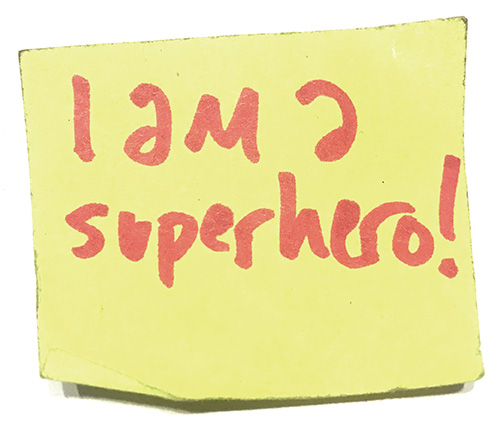

# About this class

### This class in a nutshell: MODULE: You are a superhero!

Becoming a super hero is a fairly straight forward process. You can do it this way:


ANALOG LAB: Use a pen to write "I am a superhero!" on a sticky note. 


 


INSTRUCTION: How will you identify an algorithm to reproduce the work you did in the Analog Lab?


Let's talk about what I am asking you to do / how you interpret this instruction. Will you?

1. reproduce the movements I used to make those shapes?
2. map the colors from one medium to another?
3. measure the relationship between red and yellow?
4. identify letterforms and record their sequence?

Let's start at the end.


CODE LAB: Use Python to reproduce your work from our last Analog Lab.


```python
# FOUR: identify letterforms recorded on the sticky
# and reconstitute their sequence in Python

print("I am a superhero!")
```

`I am a superhero!`

**Ask Yourselves:**

1. are these things the same?
2. How did we get from one to another?
3. Did we preserve everything in going frmo one to another?
4. are you satisfied with this mapping?

