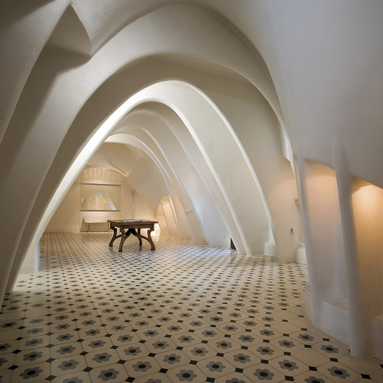

# FUNCTIONS: Draw Curves

Cables make a distinctive shape called a **catenary curve** when supported at its ends. Upside-down catenaries has been used since antiquity to build arches.  Antonio Gaudi used this method to design the cathedral spires and attics of buildings in Barcelona. 

## Analog Lab

Let’s reproduce [Gaudi’s designs](http://dataphys.org/list/gaudis-hanging-chain-models/) and the [Eads Bridge](https://math.psu.edu/treluga/textbook/catenary.html). 

## Instruction

How to use a functions to calculate the vertical coordinate of a catenary curve from the horizontal, and then to calculate safe dimensions for the supports. Show how to introduce sliders to parameterize your model.

## Code Lab

Use **functions** in Python to draw catenary arches and estimate the thickness required to support the structures. Introduce sliders to change the dimensions of your towers. 

