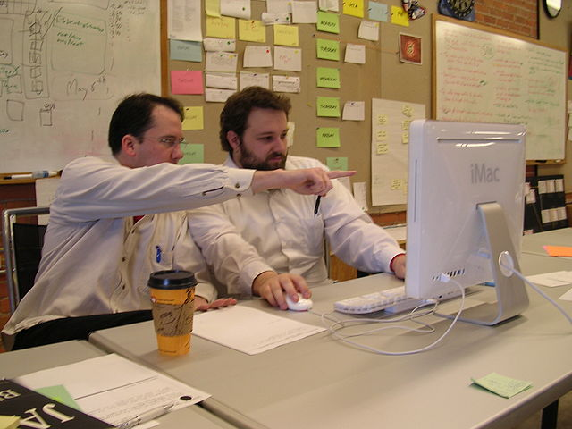

# Code Dictée

My College French teacher gave us an exercise called Dictée. She read a text that wasn't too hard \(though it usually was a little more complex than our readings\) and asked us to write down the words she was saying. She waited while we wrote, and at the end of ten to fifteen minute reading we would turn in our transcriptions.

I liked this exercise, and it came back to me later when I was teaching programming to artists. I asked the students to read code to a partner who would type it down and try to get it to run. It rarely worked the first time, so the reader would make helpful suggetstion: you missed a colon there, you didn't loop over the full range of numbers here, that variable has the wrong name \(etc.\). So the students work out how to say describe the nouns and verbs of programming plus how to help somebody who is struggling.

This activity is like pair programming \(see below\) except that you are working more on coming up with language to describe the actions taking place in the program. Focus on sequence, selection, recursion, iteration, functions, and data structures. 

Let's say that you needed to print the word "leg" for every leg on a steer. 

```python
# This is a comment, a great way to send notes to yourself and other coders
# the "#" tells Python to ignore everything to the right of the "#"

# "steer" and "person" are data structures called "dictionaries"
# Dictionaries always start with a "{" and end with a "}"
# they contain keys and values

steer = {
    # 'key': 'value',
    'legs':['LR','LF','RR','RF'],
    'arms':[]
    }

for leg in steer['legs']:
    print("leg")

leg
leg
leg
leg
```

### You might say:

> Create two dictionaries "steer" and "person." Give the steer a key called 'legs' whose value is a list of all of the steers leg by position. 
>
> Now, iterate over "steer" and print the word "leg" for every one of steer's legs.

### Pair Programming

> **Pair programming** is an [agile software development](https://en.wikipedia.org/wiki/Agile_software_development) technique in which two [programmers](https://en.wikipedia.org/wiki/Computer_programmer) work together at one workstation. One, the driver, writes [code](https://en.wikipedia.org/wiki/Source_code) while the other, the observer or navigator, [reviews](https://en.wikipedia.org/wiki/Code_review) each line of code as it is typed in. The two programmers switch roles frequently. 

> While reviewing, the observer also considers the "strategic" direction of the work, coming up with ideas for improvements and likely future problems to address. This is intended to free the driver to focus all of their attention on the "tactical" aspects of completing the current task, using the observer as a safety net and guide.

