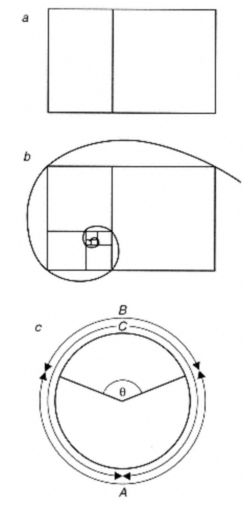

# Phyllotaxis

From the contemplation of plants’, wrote the seventeenth- century English botanist Nehemiah Grew, ‘men might first be invited to Mathematical Enquirys.’ D’Arcy Thompson thought that too, for he felt sure that the orderly arrangement of leaves or florets on a plant stem would have attracted the attention of the ancient Egyptian and Greek geometers. Aristotle’s pupil Theophrastus commented on it, as did, much later, that princely observer of nature Leonardo da Vinci. But it was not until 1754 that the Swiss botanist Charles Bonnet explained clearly the fundamental feature of ‘leaf order- ing’, known as phyllotaxis. The leaves, Bonnet pointed out, are disported around the stem in a spiral.

In 80 per cent of plant species, the succession of leaves up the stem traces out a spiral, with each leaf displaced above the one below by a more or less constant angle \(Fig. 6.1a\). The angle of offset is, in many different species, so often close to 137.58 that the fact demands explanation. Nearly all the remaining one-fifth of leafy plants show one or the other of just two alternative phyllotactic patterns. In one of these, called distichous, successive leaves sprout on opposite sides of the stem, usually with the leaf wrapped almost fully around the stem \(Fig. 6.1b\). We could regard this as a form of spiral too, in which the offset angle is 1808. The third pattern, called whorled, has little clus- ters \(whorls\) of leaves—two or more—at regular intervals up the stem, with each whorl offset so that it sits over the gaps of the whorl below. A common whorled pattern juxtaposes two leaves 180 degrees from apart offset at an angle of 90 degrees from the two below \(Fig. 6.1c\)—this is called **decussate**. Mint has this structure, and so does the stinging nettle.

 Fig. 4.37

_Three distinct patterns can be identified in the arrangement of leaves around plant stems \(phyllotaxis\): \(a\) spiral, \(b\) distichous and \(c\) whorled. Below each drawing I have shown a schematic representation of the leaf pattern seen from above, with successive leaves depicted as smaller the farther they are down the stem._

It is tempting to imagine that these arrangements are clever adapta- tions selected because they give the leaves maximum exposure to sunlight. We can be sure that arrangements that significantly obscured the sun’s rays would be selected against; but there seems no clear evidence that the observed phyllotactic patterns are optimal at harvest- ing light. Some other principle is at work.

This puzzle has proved irresistible to countless naturalists and scientists of all persuasions, many of whom have been convinced that the manifestation of such strikingly geometrical structures in nature reveals the operation of some deep-seated physical or mechanical process that imposes a kind of determinism on the biology of plant growth. It is fair to __say that, while efforts to explain phyllotaxis have so far resisted any kind of scientific consensus, they have spawned something else entirely: a view of nature closely akin to that of the Platonists or the nineteenth-century German Naturphilosophen, pervaded by a liberal amount of geometric mysticism\*. For it has been suggested that the mathematical patterns of phyllotaxis have far more profound significance than the mere fact of spiral ordering, and that at their root lie principles that govern our own sense of beauty and aesthetics. Phyllotaxis has become nothing less than the justification for a geometrization of nature.

But are we right to read so much into the shape and form of plants?

### Patterns in bloom

Probably the best candidate system for the identification of Platonic forms in development is the arrangement of leaves on a plant stem. It isn't hard to imagine all sorts of ways in which leaves could be placed up the stem; but if you go out into the garden or park you will soon discover that there are just three basic patterns. Something seems to be placing rather severe constraints on the options.

Most commonly \(in 80% of plant species\), leaves execute a spiral up the stem, with each leaf displaced above the one below by a more or less constant angle \(Fig. 4.37a\). The potato plant, for instance, has this arrangement. The angle of offset is close to 137.5° in many different species, an observation that begs for an explanation. There is, we shall see, something a little spooky about this angle. A second arrangement, called distichous, places successive leaves on opposite sides of the stem, usually with the leaf wrapped almost fully around the stem \(Fig. 4.37b\). We could regard this as a form of spiral in which the offset angle is 180°. The third pattern, called whorled, has little clusters \(whorls\) of leavestwo or moreat regular intervals up the stem, with each whorl offset so that it sits over the gaps of the whorl below. A common whorled pattern juxtaposes two leaves 180° apart offset at an angle of 90° from the two below \(Fig. 4.37c\). Mint has this arrangement, and so does the stinging nettle. The formation of these leaf patterns is called phyllotaxis \('leaf ordering'\), and it turns out to have some remarkable mathematical properties.

 Fig. 4.38 

_The pattern of phyllotaxis is determined at the tip of the growing stem \(the meristem\), where the leaf buds \(primordia\) are initiated. \(After: Koch and Meinhardt 1994.\)_

When I first observed these arrangements for myself, I assumed that they were clever adaptations selected because they give the leaves maximum exposure to sunlight. You can be sure that arrangements that failed to do this would be selected against, but a closer investigation of phyllotactic patterns reveals that there must be more here than Darwinian selection from a random pool of possibilities. They have a mathematical structure in which we can surely see the fingerprint of some physical mechanism at work.

The arrangement of leaves along a stem provides us with a somewhat distorted version of the true growth pattern, which becomes extended along the stem axis. Plants grow from the tip of the stem, where one finds a bud of multicellular tissue called the meristem. Here cells are multiplying rapidly, and just behind the advancing tip \(the apex\), side buds called primordia begin to protrude one by one. These will subsequently develop into leaves \(Fig. 4.38\). There is a roughly constant time interval, called the plastochrone, between the formation of successive primordia, with a typical duration of one day. The leaf pattern is determined by where around the boundary of the apex the primordia appear. As the stem grows upwards, the positions of successive primordia trace out a spiral when seen from above. One can see this more clearly by projecting the leaf positions onto a plane perpendicular to the stem \(Fig. 4.39\). Here some of the leaves are numbered according to the sequence in which they developed, and lines are drawn through leaves that are in contact with one another. These trace out two systems of spirals, which twist in opposite directions. The double-spiral pattern is more immediately evident when the primordia develop not into leaves but into florets in a flower head \(Fig. 4.40\), since in that case they remain all in the same plane.

 Fig. 4.40 

_The double spiral pattern of phyllotaxis is particularly clear in the arrangement of florets in a flower head \(a\) and of leaflets in a pine cone \(b\). \(Photos: Scott Camazine, Pennsylvania State University.\)_

### Golden wonder

The regularity of these spiral patterns has long been seen as the expression of mechanical laws that govern phyllotaxis. W. Hofmeister proposed in 1868 that each new primordium appears periodically on the apex boundary at an interval equal to the plastochrone, and in a position corresponding to the largest gap left by the preceding primordia. In other words, the primordia are simply trying to pack efficiently, just like atoms in a crystal. In 1904, A.H. Church took this idea further in a book called On the Relation of Phyllotaxis to Mechanical Laws, from which Fig. 4.39 is derived. And in 1979 H. Vogel performed computer calculations which showed that the preferred angle of 137.5° allows for the optimal packing of primordia placed sequentially along a spiral. Yet there is a richness to the spiral patterns for which these simple packing considerations cannot fully account.

Travelling out along any one of the lines in Fig. 4.39, you will find that the leaf numbers differ from one another by eight along the dashed lines and by 13 along the solid lines. This construction permits a classification of the phyllotaxis patternit is denoted \(8, 13\). Examples from other monkey puzzle branches show other phyllotactic relationships\(5, 8\), for instance, and \(3, 5\). To a mathematician, these pairs of numbers have a familiar ring. They are all adjacent pairs in a well-known mathematical sequence called the Fibonacci sequence, first defined in 1202 by the Italian mathematician Leonardo of Pisa, nicknamed Filius Bonacci or Fibonacci. Each term in the sequence is constructed by adding together the previous two, starting with 0 and 1. Thus, 0 + 1 = 1, and the first three terms are 0, 1, 1. The next is 1 + 1 = 2, then 1 + 2 = 3, then 2 + 3 = 5 and so on. The series runs 0, 1, 1, 2, 3, 5, 8, 13, 21, 34. . . .

Straight away we can see the adjacent pairs \(3, 5\), \(5, 8\) and \(8, 13\). But it turns out that the phyllotaxis classifications of leaves, petals or floret patterns in any plant species correspond to pairs in this series. A corollary of this is that the number of petals on most flowers corresponds to a Fibonacci number: buttercups have five, marigolds have 13, asters 21.

 Fig. 4.41 

_There is a rectangle of unique proportions that can be divided up into a square and a smaller rectangle that has the same proportions as the larger one \(a\). The ratio of equivalent sides of the larger and smaller rectangles is equal to the Golden Section. If we continue to divide the smaller rectangles in the same way, their equivalent corners trace out a logarithmic spiral \(b\). The Golden Angle is the angle at the apex of a segment of a circle of circumference C that sweeps out an arc of length B such that B/A = A/C \(c\). This angle \(θ\) is about 137.5°._

More mathematical spookiness follows. The ratio of successive terms in the Fibonacci series gets closer and closer to a constant value the further along the series one progresses: 8/13 = 0.615, for example, and 13/21 = 0.619. This ratio approaches a value of 0.618034 to the first six decimal places. This number was well known to the ancient Greeks, who knew it as the Golden Section. It can also be expressed as \(√5-1\)/2, where √5 is the square root of 5. To the Greeks, this was a harmonious, almost mystical constant of nature. If you want to draw a rectangle that can be subdivided into a square and a smaller rectangle with the same proportions as the original one \(but reduced in scale\), the ratio of the two sides must be equal to the Golden Section \(Fig. 4.41a\). These proportions were considered by the Greeks to be pleasing to the eye, and they based the dimensions of many temples, vases and other artefacts on this ratio. There is a long-standing idea that for a perfectly proportioned human body the ratio of the height of the navel to the total height \(and also some other bodily proportions\) is equal to the Golden Section. It is also related to the logarithmic spiral \(Chapter 1\), which is traced out by the extremities of a series of rectangles growing in the successive proportions of the Fibonacci sequence \(Fig. 4.41b\). The Golden Section is commonly held to be one of nature's 'special' numbers, like π or ebut one particularly intimate to the geometry of life.

Now, the Golden Section has a 'Golden Angle' associated with it. This is most easily visualized by dividing a circle into a segment whose perimeter stands in the same ratio to the rest of the circle as the latter's perimeter does to the circumference of the whole circle \(Fig. 4.41c\). The Golden Angle is that at the apex of the segment. And it is equal to 137.5°the angle at which successive leaves are commonly offset along a plant stem in spiral phyllotaxis! This correspondence between the most common phyllotactic divergence angle and the Golden Angle was first identified, to their surprise, by the mathematicians L. and A. Bravais in 1837.

If this all seems like number-juggling akin to the numerology of end-of-the-world prophets, rest assured that it is mostly an expression of the same basic fact. Once we have established that leaves spiral up a stem with offsets of the Golden Angle, then all the restthe relationship to the Fibonacci series and to the Golden Sectionfollows. Ian Stewart explains why in his book Nature's Numbers.

Phyllotaxis, therefore, contains a hidden mathematical pattern for which we are unlikely to find an explanation by rooting around in the genetics of plant developmental biology. It seems likely that there is some more universal basis to these observations.

 Fig. 4.42 

_Magnetic droplets moving from the centre to the edge of a round dish while repelling one another trace out spirals of the same kind as those observed in phyllotaxis. Yet here there are clearly only physical forces at play. \(After: Douady and Couder 1992.\)_

That this is so was impressively demonstrated by the French physicists Stéphane Douady and Yves Couder in 1992. They performed an experiment in which they dropped tiny droplets of a magnetic fluid onto a disk covered with a film of oil, on which the droplets floated. The apparatus sat in a vertical magnetic field, which polarized the magnetic particles and caused them to repel one another. The researchers also applied a horizontal magnetic field, which was stronger at the periphery of the disk than at its centrethis pulled the __droplets outwards towards the edge. Thus, as the droplets fell one by one, they were pushed out to the edges of the disk while repelling one another. When the droplets were added at a fast enough rate, they travelled outwards to form a spiral pattern just like those seen in phyllotaxis \(Fig. 4.42\), with successive droplets diverging at an angle of about 137.5°. Interestingly, when the rate of droplet addition was low enough, successive droplets diverged at 180° instead \(since in this case each droplet was simply repelled by the previous one, the others being too far away\)the pattern then corresponds to distichous phyllotaxis \(Fig. 4.37b\). Under some conditions other divergence angles were seen, which correspond to other, more rare divergence angles seen between leaves that exhibit spiral phyllotaxis.

All very wellexcept that growing plants are not magnetic droplets! But what Douady and Couder were setting out to test was the idea that phyllotaxis at the Golden Angle is preferred because it allows the optimal packing together of primordia arranged around a spiral on the meristem. They suggested that their experiment, in which the droplets repel one another along spiral trajectories, reproduces these same packing effects. Their findings imply that a plant need not somehow 'know' from the outset that 137.5° spiral phyllotaxy is the best choiceon the contrary, the dynamics of the growth process automatically select this angle. If you like, each plant 'finds out' this solution as it grows.

This brings us back to attempts to capture the dynamics of patterned biological growth using reactiondiffusion models. Can such models reproduce the spiral phyllotaxis patterns?

There are at least two separate positioning mechanisms at work in this process. One must tell the primordia how far apart they should be along the stem's axis. This mechanism in effect specifies the interval between inception of primordiathe plastochrone. The other mechanism specifies where around the stem's circumference the primordia should developsay, at a 137.5° angle from the primordium below for the case of a typical spiral phyllotaxis pattern. This is called the azimuthal position.

 Fig. 4.43 

_Spiral phyllotaxis can be generated in a reaction-diffusion model of patterning on a cylindrical plant stem, here shown rolled out into a flat sheet. The spiral sequence of primordia is indicated by dashed lines. New primordia develop below the meristem at the top of the cylinder. \(After: Koch and Meinhardt 1994.\)_

Experiments on plant growth dating back to the 1940s have shown that the axial position of a primordium is controlled by a chemical mechanismspecifically by plant hormones that are produced at the apex and transported towards the roots. Hans Meinhardt and André Koch have used this observation as the basis of a reaction-diffusion model in which the hormones act as inhibitors that repress primordia formation in a given region of the stem until the tip has grown far enough beyond this region for the hormone concentration to fall below a certain threshold value. Once this long-ranged inhibition becomes sufficiently weak, some local activator molecules switch on cell proliferation to induce the budding of a primordium.

In this model, a second activatorinhibitor mechanism controls the azimuthal position of the primordia. As this position is influenced by long-range inhibition, primordia cannot pack too closely together, just as spots in a Turing pattern cannot come too close. In a sense, this is an expression of the packing effects first suggested by Hofmeister. Meinhardt and Koch carried out calculations to find the primordia patterns that their model would produce on an idealized plant stem modelled as a narrow, hollow cylinder. They found that the primordia \(and thus ultimately the leaves\) became positioned along a spiral winding up the stem in a \(2, 3\) phyllotaxis patternone of the Fibonacci pairs observed in nature \(Fig. 4.43\). By making some simple and reasonable assumptions about how cells differentiated around the primordia, Meinhardt and Koch were even able to account for the formation of the little 'secondary' buds called axillary buds seen just above the developing leaf where it joins the stem in real plants. \(I'm told to remove these from my tomato plants to ensure a good yield of tomatoes, and __have often wondered why they were there in the first place.\)

There is no direct evidence for this pattern-forming mechanism in phyllotaxis, although the role of plant hormones suggests that it is not unreasonable. But it shows that even quite complicated body shapes in living organisms can be plausibly explained by the chemical processes of self-organization and spontaneous pattern formation that Alan Turing dreamed up over four decades ago.

