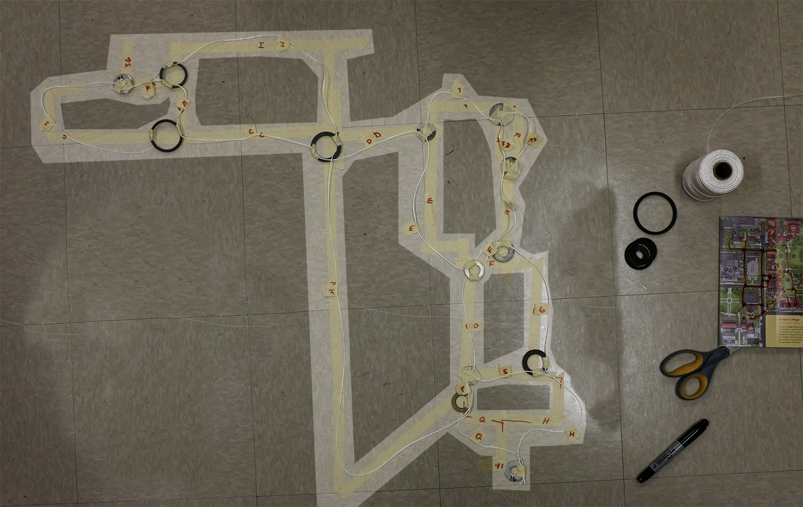
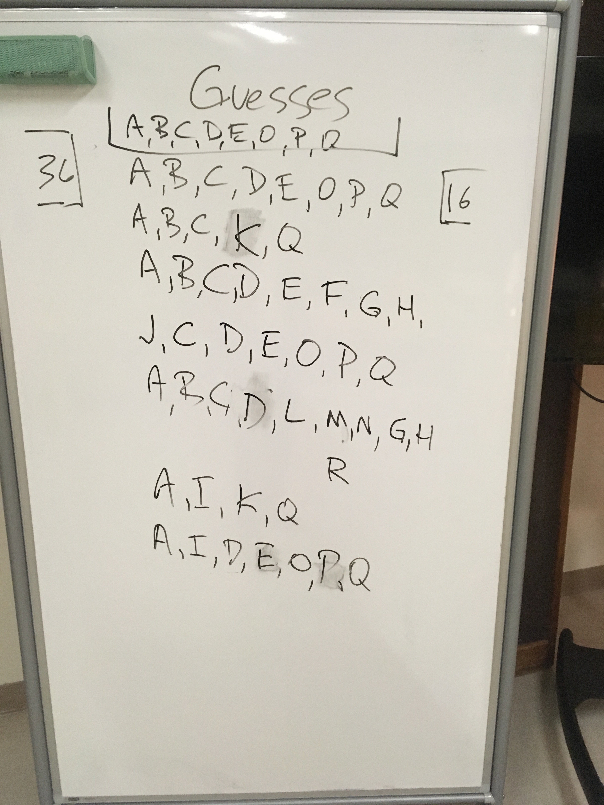

# ANALOG LAB: Find the Shortest Distance between 2 Points

### Use these rules:

1. You can't walk through walls or locked doors

2. you may only walk on paths and crosswalks \(stay off grass and streets\)

After you identify the paths, place rings at points where paths cross or split. These decision points are called **nodes**. Now you may tie strings between the rings, these are called **edges** or **vertices**. Identify each **edge** with a unique label and mark the floor with the same label.

### Take a few minutes to guess which path will be shortest.

After all of the rings/nodes are placed and the strings/edges are string between your origin and destination it is time to do the calculation. Grab the origin and destination points and pull gently. The shortest path \(or paths!\) are made of the shortest aggregate of edges. Note the labels and check your theories. 


We will start working on programming graphs in Python, learn about Dijkstra's algorithm, and consider come applications for this approach including identifying friends and like-minded people on social media.







## What are the lengths of each segment?

```python
paths = [
   (A,B,C,D,E,O,P,Q),
   (A,B,C,K,Q),
   (A,B,C,D,E,F,G,H),
   (J,C,D,E,O,P,Q),
   (A,B,C,D,L,K,N,G,H),
   (A,B,C,D,L,R,N,G,H),
   (A,I,D,E,O,P,Q)
   ]

```

