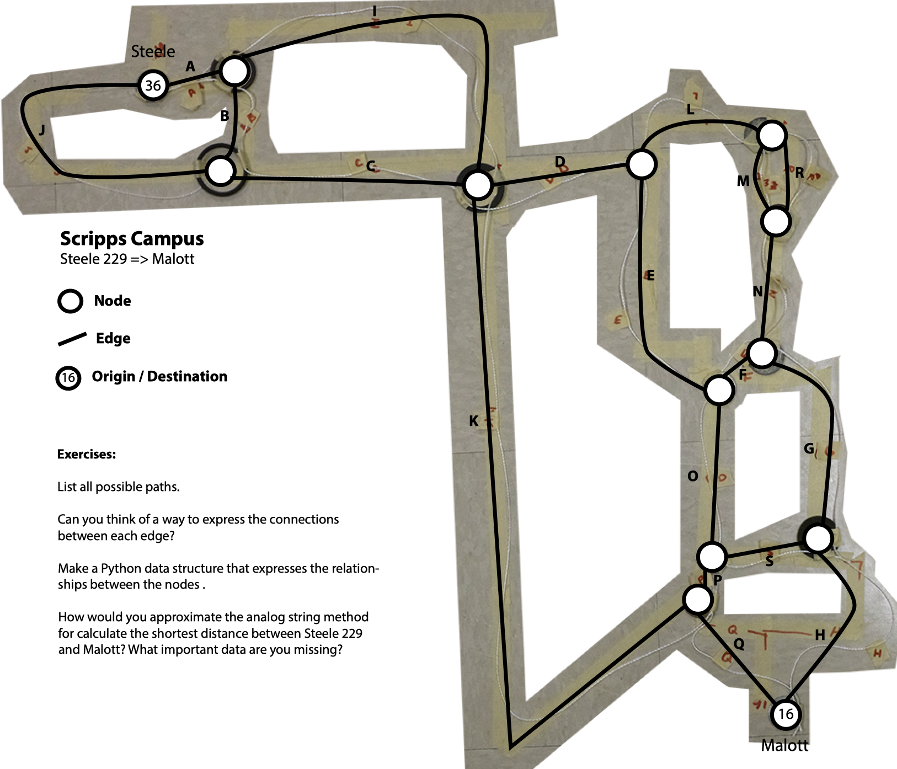

# CODE LAB: Shortest Path



```text
# Multiple variable assignments can be trickier than (I) think!
# Let's do it more explicitly

A={'name':'A','weight':1}
B={'name':'B','weight':3}
C={'name':'C','weight':6}
D={'name':'D','weight':4}
E={'name':'E','weight':7}
F={'name':'F','weight':0.5}
G={'name':'G','weight':6}
H={'name':'H','weight':6}
I={'name':'I','weight':10}
J={'name':'J','weight':9}
K={'name':'K','weight':21}
L={'name':'L','weight':4}
M={'name':'M','weight':3}
N={'name':'N','weight':4}
O={'name':'O','weight':5}
P={'name':'P','weight':0.5}
Q={'name':'Q','weight':4}
R={'name':'R','weight':3}
S={'name':'S','weight':3}

# Let's put assemble paths from sequences of edges
# Use a dictionary for each path
# Borrow the sequence of letters as a descriptive name
# like the {'name':'foo','weight':0} pattern used above 
# to define each edge
# set the weight to 0 as a default value

allpaths = [
  {'seq':(A,B,C,D,E,O,P,Q),'name':'A,B,C,D,E,O,P,Q','weight':0},
  {'seq':(A,B,C,K,Q),'name':'A,B,C,K,Q','weight':0},
  {'seq':(A,B,C,D,E,F,G,H),'name':'A,B,C,D,E,F,G,H','weight':0},
  {'seq':(J,C,D,E,O,P,Q),'name':'J,C,D,E,O,P,Q','weight':0},
  {'seq':(A,B,C,D,L,M,N,G,H),'name':'A,B,C,D,L,M,N,G,H','weight':0},
  {'seq':(A,B,C,D,L,M,R,G,H),'name':'A,B,C,D,L,M,R,G,H','weight':0},
  {'seq':(A,I,K,Q),'name':'A,I,K,Q','weight':0},
  {'seq':(A,I,D,E,O,P,Q),'name':'A,I,D,E,O,P,Q','weight':0}
]

# Loop over all of our paths

for eachpath in allpaths:
  # reset the totalweight for this path
  totalWeight = 0
  # loop over each edge in the path and add their weights together
  for eachedge in eachpath['seq']:
    # update the totalWeight
    totalWeight = totalWeight + eachedge['weight']
  
  # set the weight in this path
  eachpath['weight'] = totalWeight
  # let's see what we got
  print("The total weight for path {} is {}".format(eachpath['name'],
                                                    eachpath['weight']))
```

```text
The total weight for path A,B,C,D,E,O,P,Q is 30.5
The total weight for path A,B,C,K,Q is 35
The total weight for path A,B,C,D,E,F,G,H is 33.5
The total weight for path J,C,D,E,O,P,Q is 35.5
The total weight for path A,B,C,D,L,M,N,G,H is 37
The total weight for path A,B,C,D,L,M,R,G,H is 36
The total weight for path A,I,K,Q is 36
The total weight for path A,I,D,E,O,P,Q is 31.5
```

